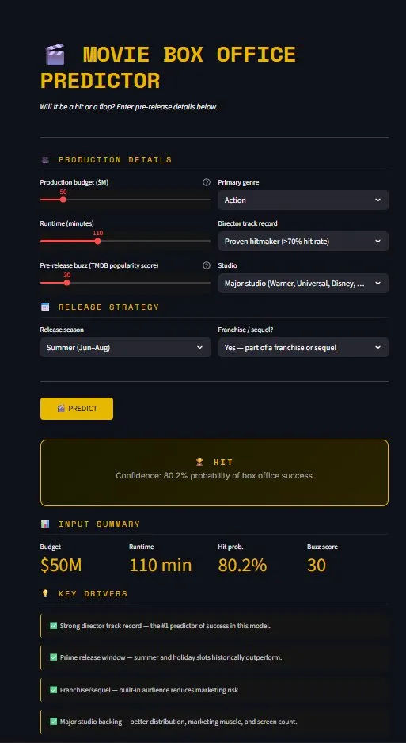
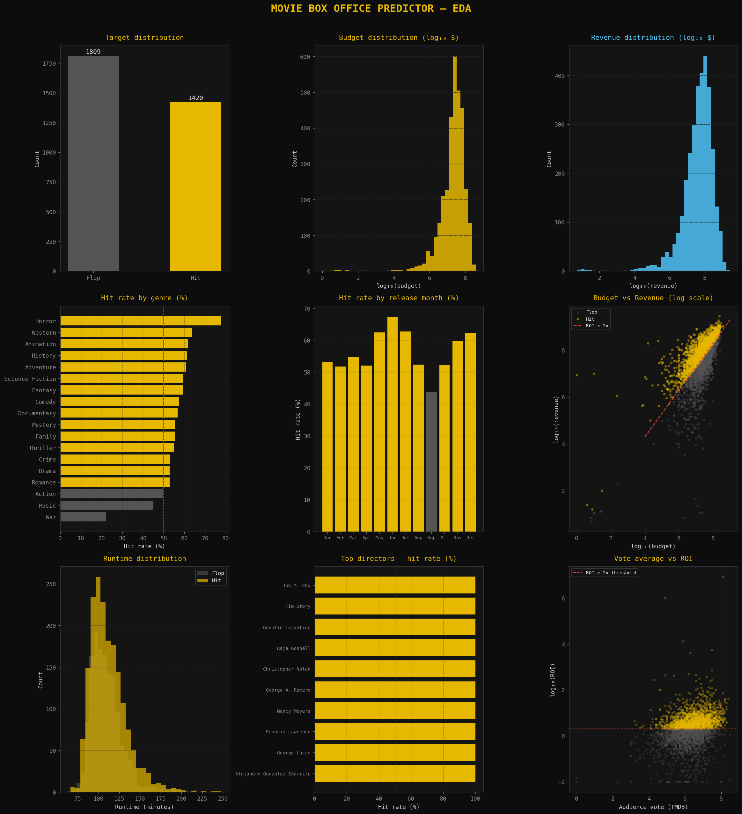

# 🎬 Movie Box Office Predictor


> **Can we predict whether a movie will be a box office hit — before it releases?**
> 
> This project builds an end-to-end machine learning pipeline that answers exactly that, using only pre-release information a studio would realistically have: budget, director track record, genre, release timing, and franchise status.

---

## 📸 App Preview

| Prediction Screen | EDA Dashboard |
|---|---|
|  |  |

---

## 🔑 Key Finding

> **A director's historical track record is the single strongest pre-release predictor of box office success — more important than budget, genre, or franchise status.**

This was the top feature in both XGBoost feature importance and SHAP explainability analysis, with nearly 3× the impact of the next-best predictor (pre-release popularity).

---

## 📊 Results

| Model | Cross-Val AUC | Notes |
|---|---|---|
| Logistic Regression | ~0.84 | Baseline |
| Random Forest | ~0.91 | Strong ensemble |
| **XGBoost** | **0.937** | Best model — saved for app |

- **Test set accuracy: ~85%**
- **Confusion matrix: 321 hits + 228 flops correctly classified**
- **Balanced classes: 56% hit rate — no oversampling needed**

---

## 🏗️ Project Structure

```
movie-box-office-predictor/
│
├── movie_eda.py          # Phase 1: Data loading & EDA (9-chart dashboard)
├── movie_model.py        # Phase 2: Feature engineering + model training + SHAP
├── movie_app.py          # Phase 3: Streamlit prediction app
│
├── xgb_model.pkl         # Trained XGBoost model
├── scaler.pkl            # Fitted StandardScaler
├── features.pkl          # Feature name list
│
├── screenshots/
│   ├── app_preview.png
│   ├── eda_dashboard.png
│   ├── model_evaluation.png
│   └── shap_explainability.png
│
├── requirements.txt
└── README.md
```

---

## 🧠 Methodology

### 1. Data
- **Source:** [TMDB 5000 Movies Dataset](https://www.kaggle.com/datasets/tmdb/tmdb-movie-metadata) (Kaggle)
- **Size:** 4,803 movies merged across two files (movies + credits)
- **Target:** Binary — *Hit* if `revenue ≥ 2× budget` (ROI-based definition), else *Flop*
- **Modeling sample:** 3,229 movies with both budget and revenue data

### 2. Feature Engineering
All features use only information available **before a film releases**:

| Feature | Description |
|---|---|
| `log_budget` | Log₁₀ of production budget — compresses heavy skew |
| `director_hit_rate` | Historical % of director's films that were hits |
| `popularity_log` | Log-scaled TMDB pre-release popularity score |
| `is_franchise` | Detected via keywords: sequel, remake, Marvel, DC, etc. |
| `big_studio` | Flag for major studios (Warner, Universal, Disney, etc.) |
| `runtime` | Film length in minutes |
| `genre_*` | One-hot encoded top 8 genres |
| `season_*` | Release season: summer, holiday, spring, off-peak |

### 3. Models Compared
Three classifiers were compared using 5-fold stratified cross-validation:
- Logistic Regression (baseline)
- Random Forest (200 estimators)
- XGBoost (200 estimators, learning rate 0.05, max depth 4)

### 4. Explainability
SHAP (SHapley Additive exPlanations) was used to interpret the XGBoost model at both global and per-prediction level, revealing:
- High `director_hit_rate` pushes predictions strongly toward Hit
- High `log_budget` alone does **not** guarantee a hit — bloated budgets are a risk signal
- Horror + low budget is the dataset's most reliable hit formula
- Drama has the lowest hit rate of any genre

---

## 🚀 Running Locally

### Prerequisites
```bash
pip install -r requirements.txt
```

### Step 1 — Download the dataset
Get both CSV files from [Kaggle](https://www.kaggle.com/datasets/tmdb/tmdb-movie-metadata) and place them in the project folder:
- `tmdb_5000_movies.csv`
- `tmdb_5000_credits.csv`

### Step 2 — Run EDA
```bash
python movie_eda.py
```
Generates `eda_dashboard.png` with 9 exploratory charts.

### Step 3 — Train the model
```bash
python movie_model.py
```
Trains 3 models, outputs evaluation charts and SHAP plots, saves `.pkl` files.

### Step 4 — Launch the app
```bash
streamlit run movie_app.py
```
Opens at `http://localhost:8501`

---

## 💡 Insights for the Film Industry

1. **Director track record dominates.** Studios should weight a director's hit-rate history heavily in greenlight decisions — it outweighs budget and franchise status.

2. **Big budgets are not a safety net.** High-budget films showed *lower* average hit probability in isolation — suggesting budget inflation without strong creative anchors is a risk, not a hedge.

3. **Horror is the highest-ROI genre.** Low production cost + genre-loyal audience = the most reliable hit formula in the dataset (e.g. *Get Out*, *Paranormal Activity*).

4. **Summer and holiday windows matter, but less than expected.** Release timing improved hit probability modestly — but a weak film in a prime slot still flops.

5. **Drama underperforms commercially.** Despite critical acclaim, Drama had the lowest box office hit rate — studios trading awards for revenue should note this.

---

## 🛠️ Tech Stack

- **Python 3.10+**
- **Pandas & NumPy** — data wrangling
- **Matplotlib & Seaborn** — visualisation
- **Scikit-learn** — preprocessing, model comparison, evaluation
- **XGBoost** — primary classifier
- **SHAP** — model explainability
- **Streamlit** — web app
- **Joblib** — model serialisation

---

## 👤 Author

**Anurag**  
PGDM — Data Science  
[LinkedIn](https://linkedin.com/in/your-profile) · [GitHub](https://github.com/your-username)

---

## 📄 License

MIT License — free to use, modify, and share with attribution.

---

*Built as part of PGDM Data Science coursework. Dataset credit: The Movie Database (TMDB).*
